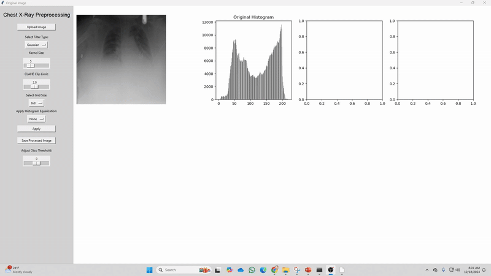

# Advanced Image Processing Workflow for Chest X-ray Enhancement and Segmentation

This repository contains a workflow for enhancing and segmenting chest X-ray images using techniques like CLAHE for contrast enhancement and algorithms (Otsu's thresholding, region growing, snake) for lung segmentation. Built in Python with OpenCV, scikit-image, and Matplotlib, it includes a Jupyter notebook with GUIs and a PowerPoint presentation.




## Overview

Chest X-rays often have low contrast and noise. This workflow includes:
- Preprocessing: Gaussian/Median filters and normalization.
- Enhancement: Adaptive CLAHE with dynamic parameters.
- Segmentation: Otsu, region growing, and snake algorithms.
- Analysis: PSNR, SNR, SSIM metrics.

## Features

- GUI for CLAHE parameter optimization.
- Preprocessing pipeline with filters and equalization.
- Classical segmentation methods.
- Visualizations (grids, contours, metrics).
- Presentation slides.

## Installation

Clone the repo:
```bash
git clone https://github.com/your-username/Advanced-Image-Processing-Workflow-for-Chest-X-ray.git
cd Advanced-Image-Processing-Workflow-for-Chest-X-ray
